# Tutorial do Escala RH

Guia passo a passo para o **RH** e os **gestores** montarem a escala, avisarem os funcionários pelo WhatsApp e
resolverem os problemas do dia a dia.

> Todas as telas deste tutorial foram capturadas no sistema real, usando dados de exemplo com o prefixo **[TESTE]**
> (uma clínica fictícia). Telefones e nomes reais foram borrados.

---

## Sumário

1. [O que é o sistema e quem usa](#1-o-que-é-o-sistema-e-quem-usa)
2. [Conceitos: setor, turno, padrão, plantão, escala, ausência, lembrete e bot](#2-conceitos)
3. [Primeiro acesso, senha e navegação](#3-primeiro-acesso-senha-e-navegação)
4. [Configuração inicial passo a passo](#4-configuração-inicial-passo-a-passo)
5. [Montando a escala do mês](#5-montando-a-escala-do-mês)
6. [Calendário no dia a dia](#6-calendário-no-dia-a-dia)
7. [Ausências](#7-ausências)
8. [WhatsApp: conexão, lembretes e bot](#8-whatsapp-conexão-lembretes-e-bot)
9. [Histórico de mensagens e o que fazer quando falha](#9-histórico-de-mensagens-e-o-que-fazer-quando-falha)
10. [Rotina mensal do RH](#10-rotina-mensal-do-rh)
11. [Perguntas frequentes](#11-perguntas-frequentes)
- [Anexo: divergências e sugestões de melhoria](#anexo-divergências-e-sugestões-de-melhoria)

---

## 1. O que é o sistema e quem usa

O **Escala RH** organiza os plantões da equipe num calendário e avisa cada funcionário pelo **WhatsApp** antes do
turno. O funcionário também pode consultar a própria escala conversando com o **bot** no WhatsApp.

| Perfil | Onde acessa | O que pode fazer |
|---|---|---|
| **Administrador** | Painel | Tudo: usuários, setores, turnos, padrões, funcionários, escalas, ausências, mensagens, conexão do WhatsApp, regras de lembrete, configurações do bot e a documentação do sistema. |
| **Gestor** | Painel | Funcionários, plantões, ausências e mensagens **somente dos setores vinculados a ele**. Vê (sem alterar) setores, turnos e padrões. |
| **Funcionário** | Só WhatsApp | Recebe os lembretes e consulta a escala pelo bot. **Não tem login.** |

**Menu do administrador × menu do gestor.** O gestor não vê *Usuários*, *Conexão*, *Regras de lembrete*,
*Configurações do bot* nem *Documentação*, e o calendário dele mostra só os plantões dos setores dele.

| Administrador | Gestor (só "[TESTE] Enfermagem") |
|---|---|
| 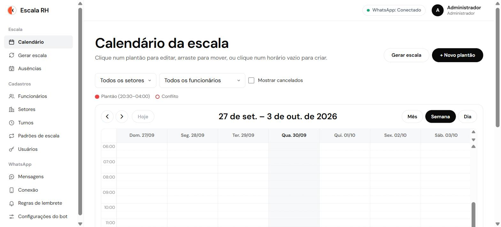 | 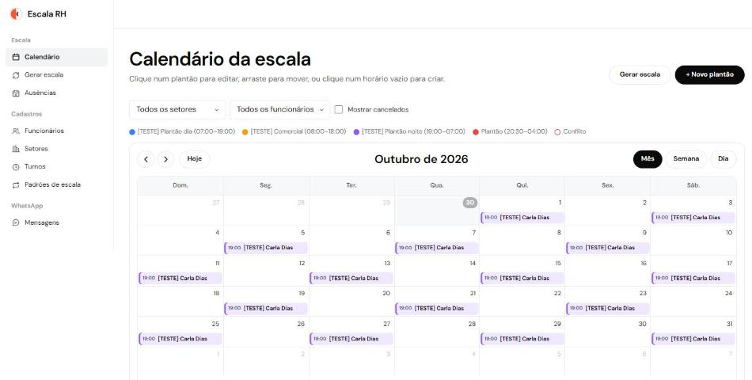 |

Na tela **Setores**, o gestor vê apenas os setores vinculados a ele, sem botão de editar:

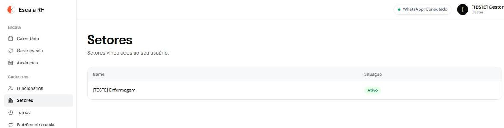

---

## 2. Conceitos

| Termo | O que é | Exemplo |
|---|---|---|
| **Setor** | Área da empresa. Gestores só veem os setores vinculados a eles. | Enfermagem, Portaria, Recepção |
| **Turno** | Um **horário** de trabalho, com nome e cor. Pode virar a noite. | Plantão dia 07:00–19:00 · Plantão noite 19:00–07:00 · Comercial 08:00–18:00 |
| **Padrão de escala** | **Quais dias** a pessoa trabalha (não o horário). | 12x36, 6x1, 5x2 |
| **Plantão** | Um dia e horário concretos de um funcionário no calendário. É o que gera lembrete. | Ana, qui 01/10, 07:00–19:00, Enfermagem |
| **Escala** | O conjunto de plantões de um período (ex.: o mês). | Escala de outubro da Enfermagem |
| **Ausência** | Férias, atestado, folga ou outro motivo, por período de datas. Os plantões nesses dias ficam bloqueados. | Ana de férias de 12 a 21/10 |
| **Regra de lembrete** | Quando e com qual texto o WhatsApp avisa o funcionário. | "Véspera 18h", "1 hora antes" |
| **Bot** | Atendimento automático no WhatsApp: o funcionário consulta a própria escala. | Envia `1` → recebe o próximo turno |

> **Fórmula para guardar:**
> **Padrão** (quais dias) + **Turno** (que horas) + **Data de início do ciclo** + **Período** = **Plantões**

### Tipos de padrão

- **Ciclo**: X dias de trabalho e Y de folga, repetindo sem olhar o dia da semana.
  - **12x36** = 1 dia de trabalho e 1 de folga, com turno de 12 h. Já vem cadastrado.
  - **6x1** = 6 dias de trabalho e 1 de folga. Já vem cadastrado.
  - **4x2** = 4 dias de trabalho e 2 de folga.
- **Semanal**: dias fixos da semana.
  - **5x2** = segunda a sexta. Já vem cadastrado.
  - **Seg a sáb** = segunda a sábado.

### Data de início do ciclo (o ponto que mais gera dúvida)

É o **primeiro dia de trabalho** do ciclo. Duas pessoas no 12x36 com inícios em dias seguidos **se revezam** e cobrem
todos os dias. Para continuar a escala do mês anterior, informe um dia em que a pessoa **trabalhou** no ciclo atual. O
sistema calcula a sequência para frente.

Exemplo de outubro/2026 (01/10 é uma quinta-feira):

| Dia | 01 | 02 | 03 | 04 | 05 | 06 | ... |
|---|---|---|---|---|---|---|---|
| Equipe A (início 01/10) | trabalha | folga | trabalha | folga | trabalha | folga | dias ímpares |
| Equipe B (início 02/10) | folga | trabalha | folga | trabalha | folga | trabalha | dias pares |

---

## 3. Primeiro acesso, senha e navegação

### Entrar no painel

1. Abra o endereço do painel. Quem instalou o sistema informa esse endereço.
2. Digite o **E-mail** e a **Senha** recebidos e clique em **Entrar**.

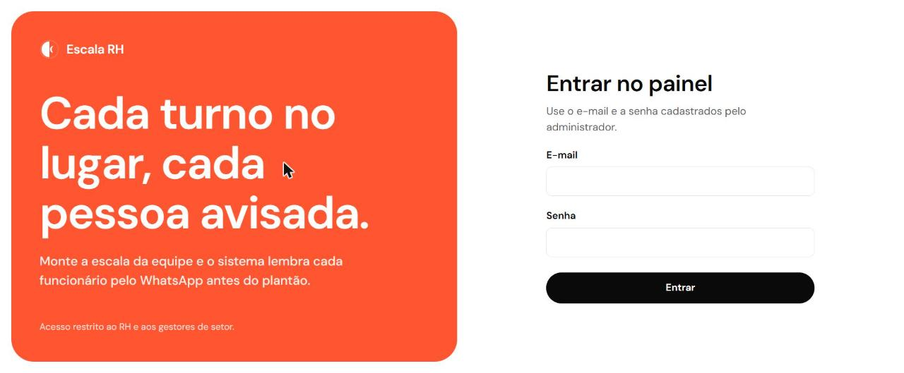

- A sessão dura **12 horas**. Depois disso é preciso entrar de novo.
- Depois de **5 tentativas erradas em 1 minuto**, espere um minuto antes de tentar de novo.
- Esqueceu a senha? Peça a um administrador para definir uma nova em **Usuários** (seção 4.4).

### Trocar a senha

1. Clique no seu nome, no canto superior direito. Aparecem as opções **Trocar senha** e **Sair**.

   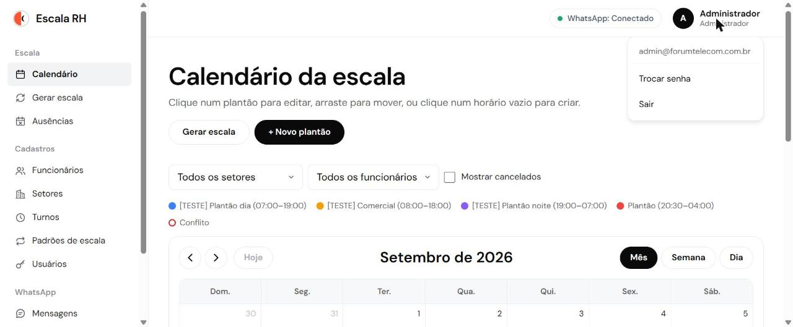

2. Em **Trocar senha**, preencha **Senha atual**, **Nova senha** (mínimo de 8 caracteres) e **Confirmar nova senha**.
   Depois clique em **Salvar**.

   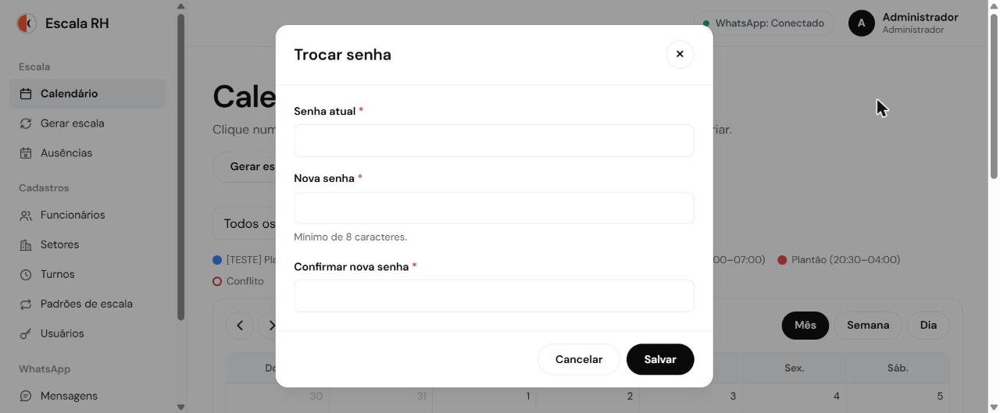

### Como navegar

- O **menu lateral** tem estes grupos:
  - **Escala**: Calendário, Gerar escala, Ausências.
  - **Cadastros**: Funcionários, Setores, Turnos, Padrões de escala, Usuários.
  - **WhatsApp**: Mensagens, Conexão, Regras de lembrete, Configurações do bot.
  - **Administração** (só administrador): **Documentação** — este tutorial, o guia rápido do RH e toda a
    documentação técnica do sistema, dentro do próprio painel.
- No topo fica o **status do WhatsApp** ("WhatsApp: Conectado", com bolinha verde). Se o WhatsApp cair, aparece uma
  **faixa preta** no topo do painel avisando que os lembretes não serão enviados.

---

## 4. Configuração inicial passo a passo

**Ordem recomendada:** Setores → Turnos → Padrões de escala → Usuários (gestores) → Funcionários → Gerar escala → conferir no Calendário.

> **Setor, turno, padrão e usuário não são apagados**: para "remover", edite o item e desmarque **ativo**. Itens
> inativos somem das listas de escolha, mas o histórico continua. **Funcionário** também pode ser desativado e, se
> for preciso, **excluído** de vez (seção 4.5).

Cenário usado como exemplo: uma **clínica** com atendimento 24 h na enfermagem e na portaria, mais um setor
administrativo em horário comercial.

### 4.1 Setores (administrador)

1. Abra **Cadastros › Setores** e clique em **+ Novo setor**.
2. Digite o **Nome** (ex.: `[TESTE] Enfermagem`), deixe **Setor ativo** marcado e clique em **Salvar**.

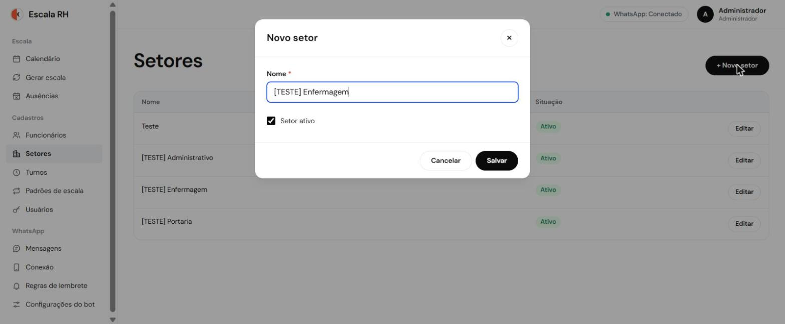

Repita para Portaria e Administrativo:

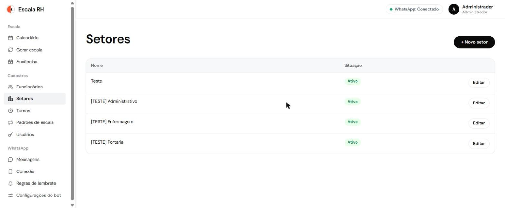

### 4.2 Turnos (administrador)

1. Abra **Cadastros › Turnos** e clique em **+ Novo turno**.
2. Preencha **Nome**, **Hora de início** e **Hora de fim**. O painel mostra a **Duração** sozinho.
3. Escolha a **Cor no calendário** e clique em **Salvar**.

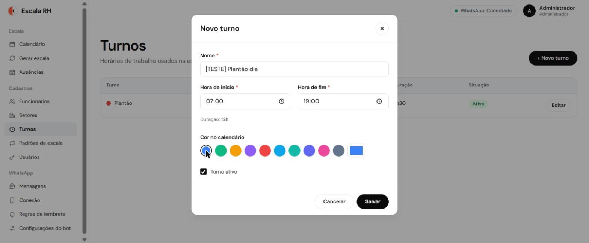

**Turno que vira a noite:** com início 19:00 e fim 07:00, o painel avisa "*termina no dia seguinte (vira a noite)*".
Não é preciso fazer nada especial.

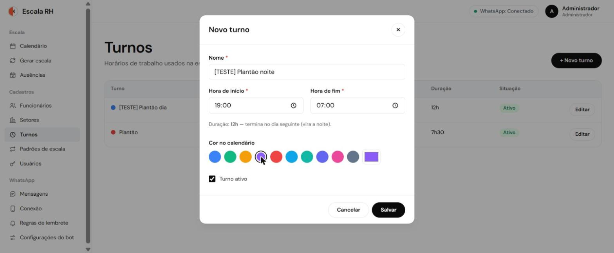

Na lista, o turno noturno ganha a etiqueta **vira a noite**:

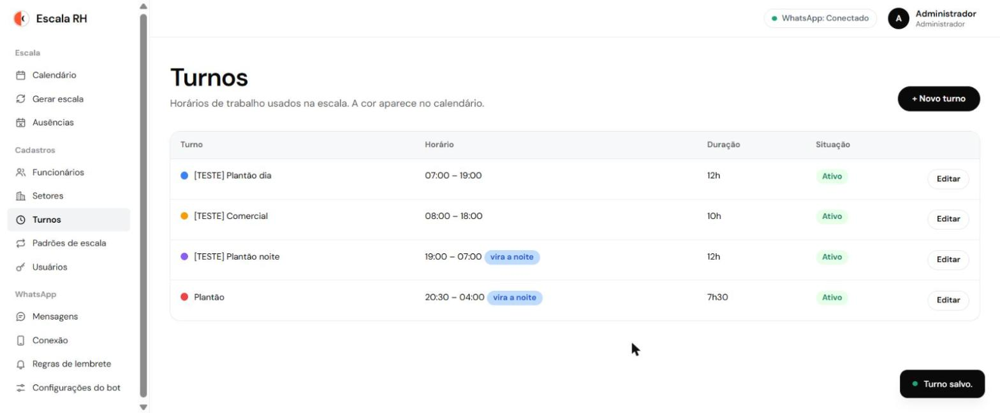

| Turno de exemplo | Início | Fim | Observação |
|---|---|---|---|
| [TESTE] Plantão dia | 07:00 | 19:00 | 12 h |
| [TESTE] Plantão noite | 19:00 | 07:00 | atravessa a meia-noite |
| [TESTE] Comercial | 08:00 | 18:00 | 10 h |

### 4.3 Padrões de escala (administrador)

Os padrões **12x36**, **6x1** e **5x2** já vêm cadastrados:

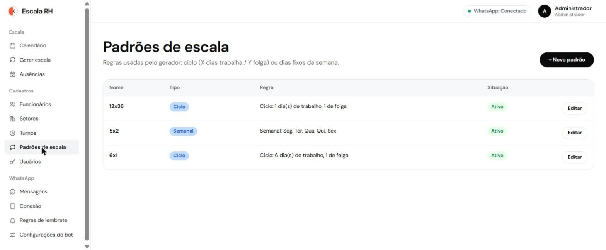

**Criar um padrão de ciclo (ex.: 4x2):**

1. Clique em **+ Novo padrão**.
2. Digite o nome, escolha **Ciclo (trabalha X dias, folga Y)** e preencha **Dias de trabalho** = 4 e **Dias de folga** = 2.
3. Clique em **Salvar**.

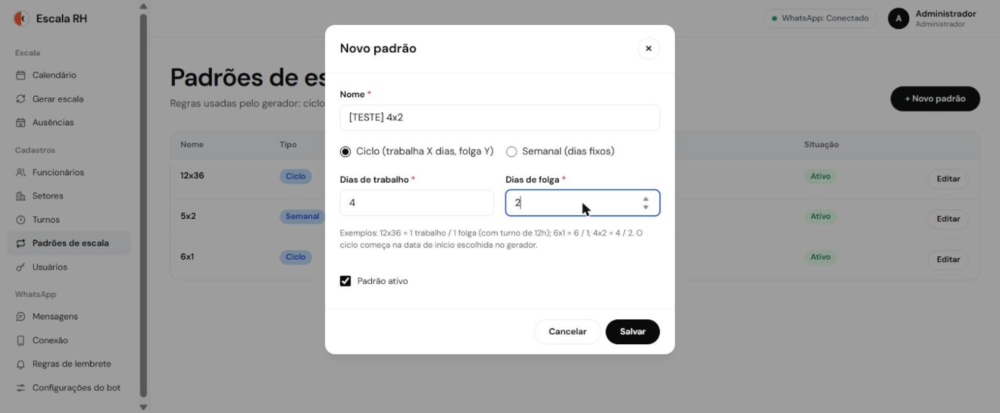

**Criar um padrão semanal (ex.: segunda a sábado):**

1. Escolha **Semanal (dias fixos)**.
2. Marque os **Dias da semana trabalhados** e clique em **Salvar**.

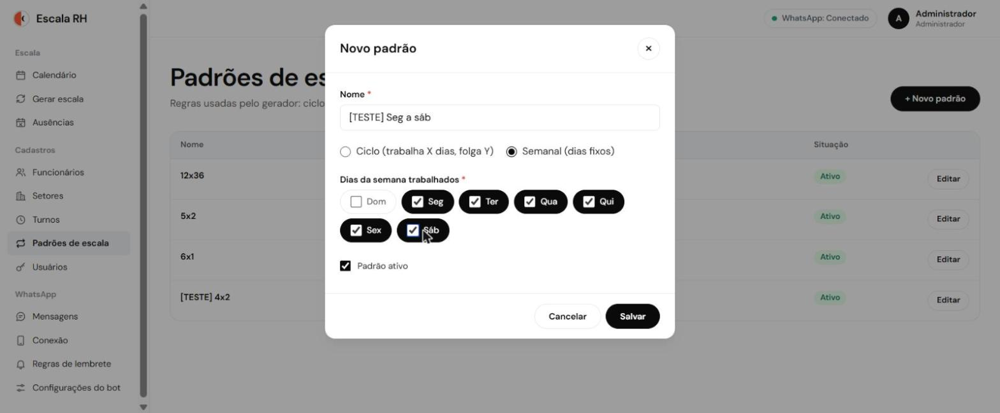

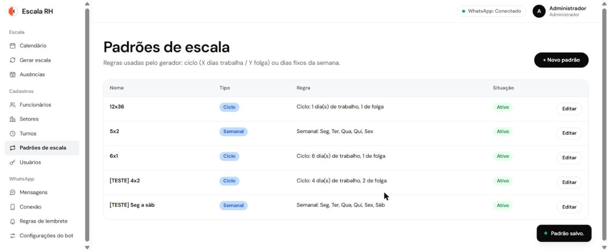

> Lembre-se: o padrão diz **quais dias**. O **horário** vem do turno escolhido na hora de gerar a escala.

### 4.4 Usuários do painel (administrador)

1. Abra **Cadastros › Usuários** e clique em **+ Novo usuário**.
2. Preencha **Nome**, **E-mail** e **Senha** (mínimo de 8 caracteres).
3. Escolha o perfil, **Gestor** ou **Administrador**.
4. Para gestor, marque os **Setores que este gestor pode ver**.
5. Deixe **Usuário ativo** marcado e clique em **Salvar**.

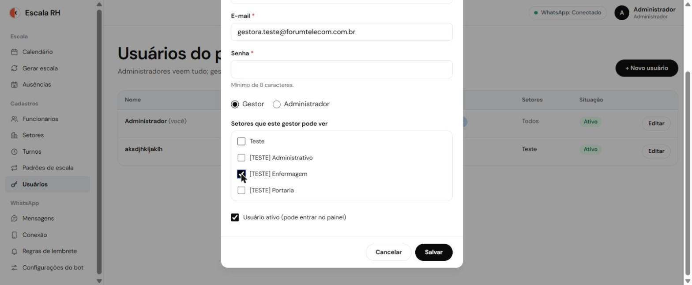

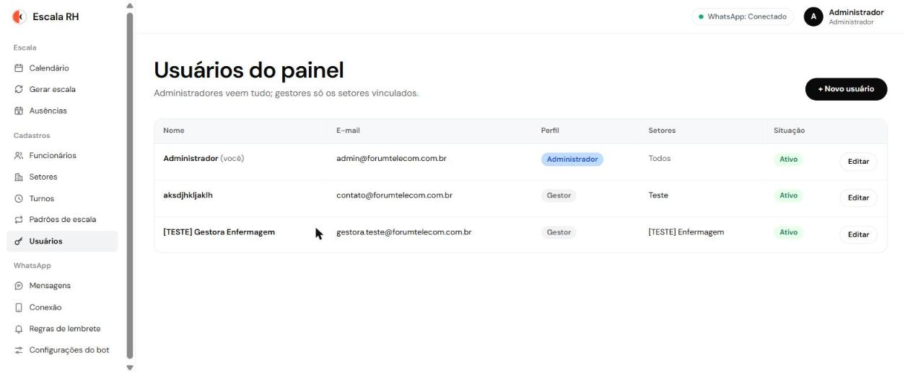

**Redefinir a senha de alguém:** clique em **Editar** e preencha **Nova senha**. Se deixar em branco, a senha atual é mantida.
**Bloquear o acesso:** clique em **Editar** e desmarque **Usuário ativo**. O bloqueio vale na hora.

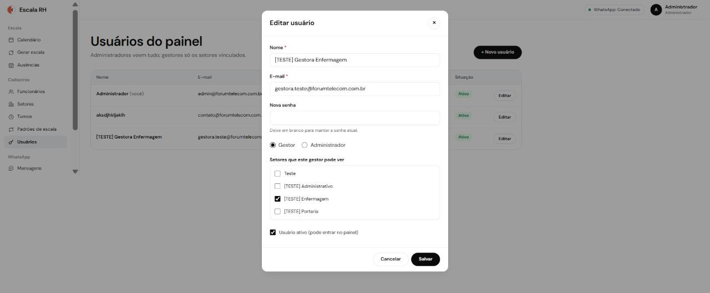

### 4.5 Funcionários

1. Abra **Cadastros › Funcionários** e clique em **+ Novo funcionário**.
2. Preencha **Nome** e **WhatsApp**. No WhatsApp, digite **só o DDD e o celular com o 9 na frente**: o campo formata
   sozinho como `(51) 99999-8888` e o **+55** é colocado automaticamente.
3. **Confira a linha "Será salvo como +55 (DD) ..."** logo abaixo do campo, principalmente o DDD.
4. Escolha o **Setor**, preencha **Cargo** e **Observações** (opcionais) e clique em **Salvar**.

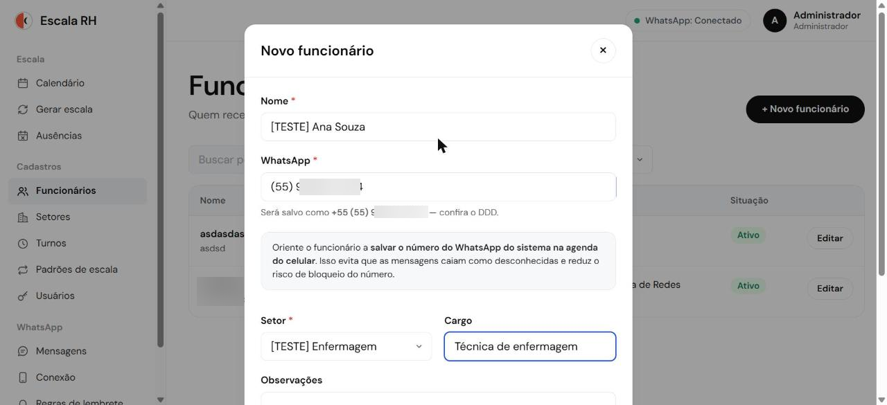

> O quadro cinza no formulário lembra: **oriente cada funcionário a salvar o número do WhatsApp da empresa na agenda
> do celular**. Isso evita que as mensagens caiam como "desconhecidas" e reduz o risco de bloqueio do número.

**Erros comuns ao salvar:**

| Mensagem | O que significa |
|---|---|
| "Celular precisa ter 9 dígitos (com o 9 na frente)." | Faltou o 9 no começo do celular. |
| "Telefone já cadastrado para …" | Esse número já pertence a outro funcionário **ativo**. Funcionário inativo não bloqueia o número. |

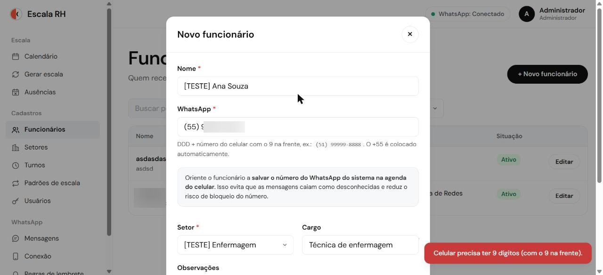

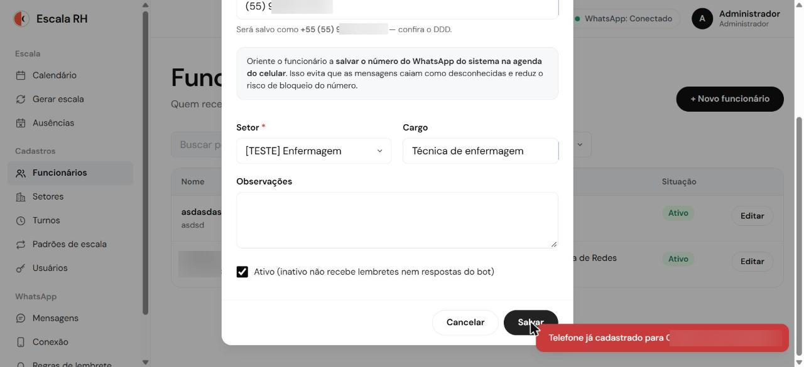

**Ativo × inativo:** o funcionário **inativo não recebe lembretes nem respostas do bot** e **libera o número**: o
mesmo celular pode ser cadastrado para outra pessoa. Para desligar alguém, abra **Editar** e desmarque **Ativo**
(o histórico de plantões fica guardado). Ao reativar, o sistema confere se o número não passou a ser de outro
funcionário ativo.

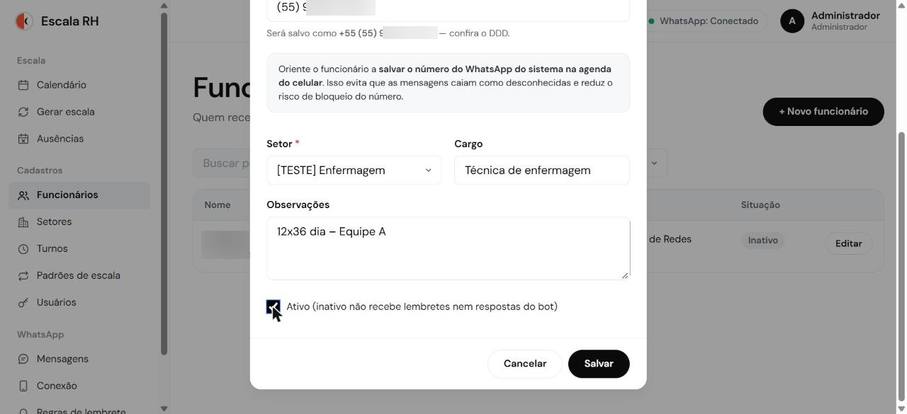

**Excluir de vez:** na lista, clique em **Excluir** na linha do funcionário e confirme. A exclusão **apaga junto
todos os plantões (passados e futuros) e as ausências** da pessoa; o histórico de mensagens continua, sem o nome.
**Não dá para desfazer.** Use para cadastros feitos por engano; para desligamentos, prefira desmarcar **Ativo**.

Use a **busca** (nome ou telefone) e os filtros de **setor** e **situação** (Somente ativos / Somente inativos / Todos):

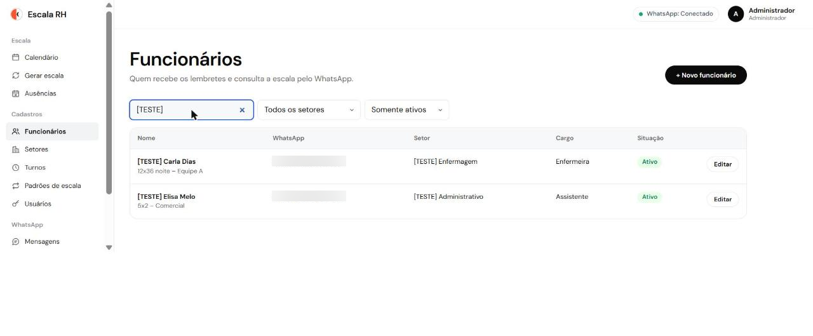

Funcionários do cenário de exemplo:

| Nome | Setor | Cargo | Escala planejada |
|---|---|---|---|
| [TESTE] Ana Souza | Enfermagem | Técnica de enfermagem | 12x36 dia, Equipe A (início dia 1) |
| [TESTE] Bruno Lima | Enfermagem | Técnico de enfermagem | 12x36 dia, Equipe B (início dia 2) |
| [TESTE] Carla Dias | Enfermagem | Enfermeira | 12x36 noite, Equipe A |
| [TESTE] Diego Rocha | Portaria | Porteiro | 6x1, Plantão dia |
| [TESTE] Elisa Melo | Administrativo | Assistente | 5x2, Comercial |

---

## 5. Montando a escala do mês

Abra **Escala › Gerar escala**. O período já vem preenchido com o **próximo mês**. Faça **uma geração para cada grupo**
de pessoas que segue o **mesmo padrão + turno + início de ciclo**.

### 5.1 Passo a passo (exemplo: 12x36 dia – Equipe A)

1. **1. Funcionários:** marque quem entra na escala. Dá para filtrar por setor ou buscar pelo nome.
2. **2. Padrão, turno e período:**
   - **Padrão de escala**: 12x36. O painel mostra a regra, "Ciclo: 1 dia(s) de trabalho, 1 de folga".
   - **Turno**: [TESTE] Plantão dia (07:00–19:00).
   - **Período — de / até**: no máximo **93 dias** por geração.
   - **Data de início do ciclo**: o primeiro dia de trabalho (aqui, 01/10).
   - **Setor dos plantões**: deixe "Setor de cada funcionário", salvo exceções.

   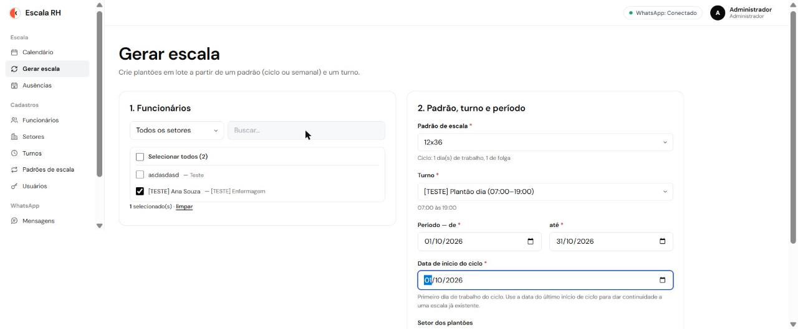

3. Clique em **Pré-visualizar**. **Nada é gravado ainda.** Aparecem o total de plantões, quantos têm conflito, o
   **resumo por funcionário** (plantões, horas e conflitos de cada pessoa) e a lista dia a dia.

   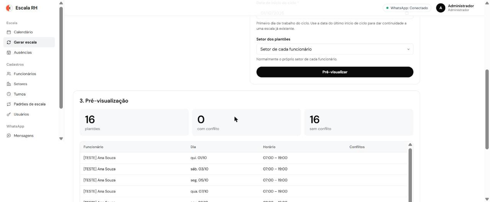

4. Confira a lista e clique em **Gerar N plantão(ões)**. O navegador pede confirmação ("Gerar 16 plantão(ões)?"):
   clique em **OK**.

   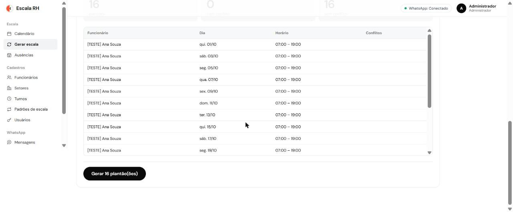

5. O resultado mostra quantos foram **criados**, **pulados** e **substituídos**. Use **Ver no calendário** para conferir.

   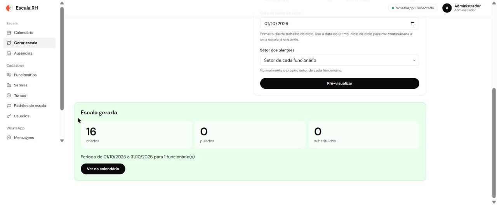

### 5.2 Duas equipes se revezando (12x36 A e B)

Repita a geração para o Bruno com o **mesmo padrão e turno**, mas **início do ciclo = dia 02**. No calendário, Ana e
Bruno se alternam e todos os dias ficam cobertos:

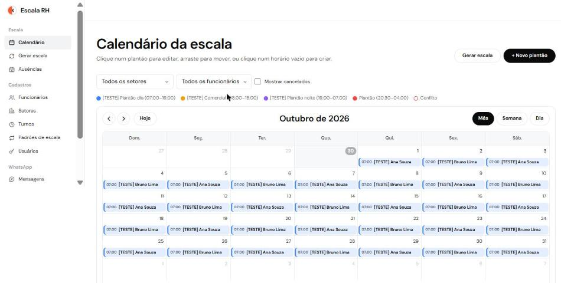

### 5.3 Outros padrões

- **12x36 noite** (Carla, Plantão noite, início dia 1): a prévia mostra "19:00 – 07:00 (+1 dia)". No calendário, o
  plantão começa às 19:00 e **continua até 07:00 do dia seguinte**.

  | Começa às 19:00 (qui) | Termina às 07:00 (sex) |
  |---|---|
  | 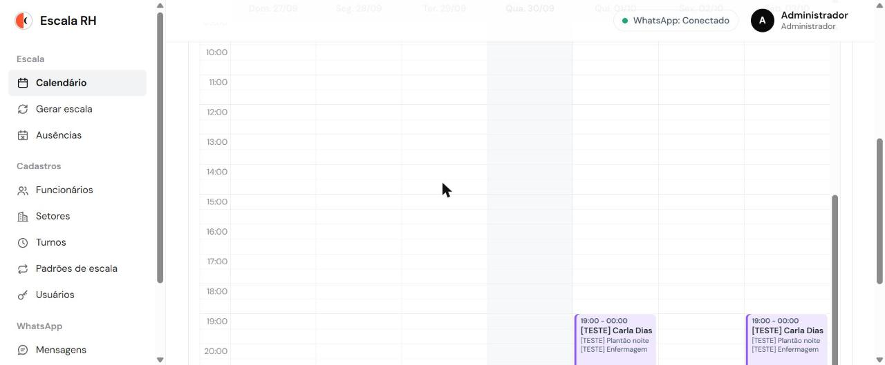 | 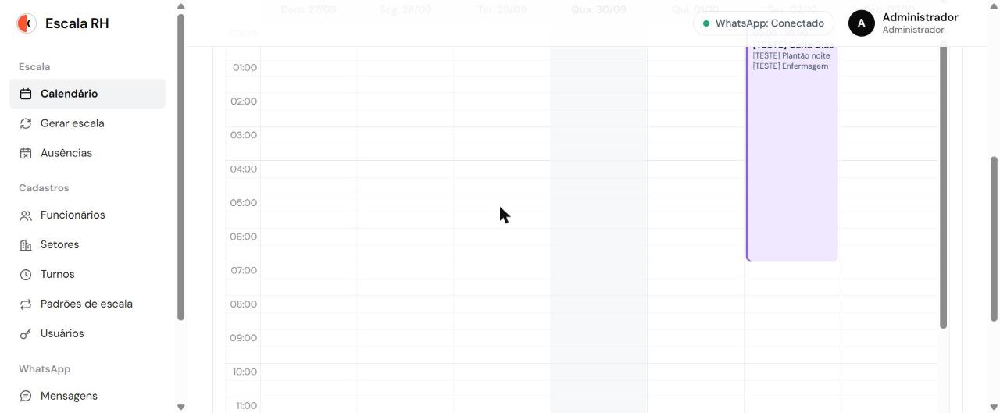 |

- **6x1** (Diego, Plantão dia, início dia 1): 27 plantões em outubro. Como o ciclo tem 7 dias (6 + 1), a folga cai
  sempre no **mesmo dia da semana** (no exemplo, todas as quartas). O gerador avisa isso logo abaixo da data de
  início do ciclo. Para espalhar as folgas da equipe, gere grupos com datas de início diferentes: quem começa um
  dia depois folga um dia depois.

  No exemplo abaixo (outro funcionário de teste, novembro, início do ciclo em 01/11, um domingo), o aviso diz
  "Folga fixa toda semana: sábado", e a prévia traz o **resumo por funcionário**:

  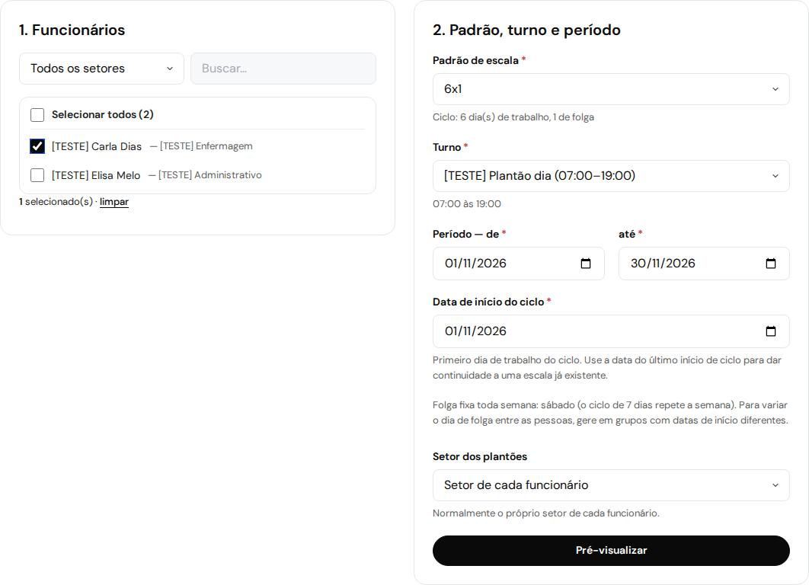

  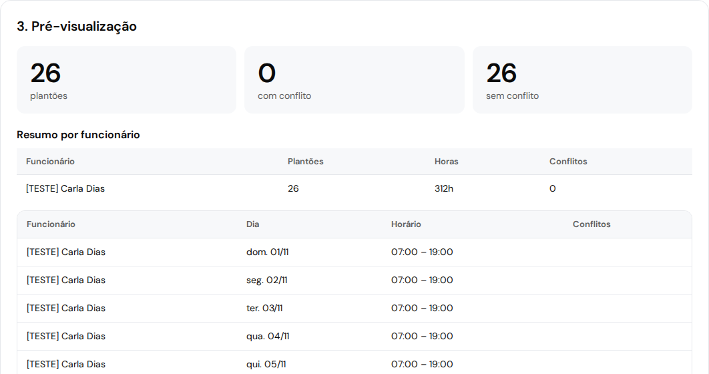

  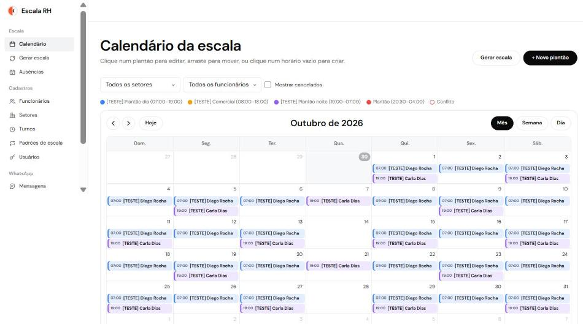

- **5x2** (Elisa, Comercial): só dias úteis, e **sábados e domingos ficam livres**.

  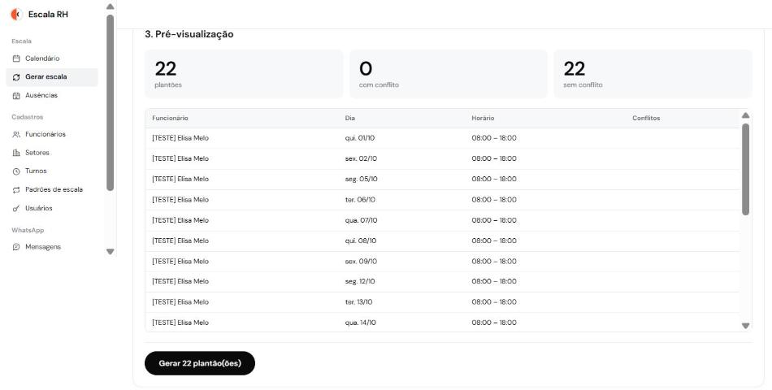

  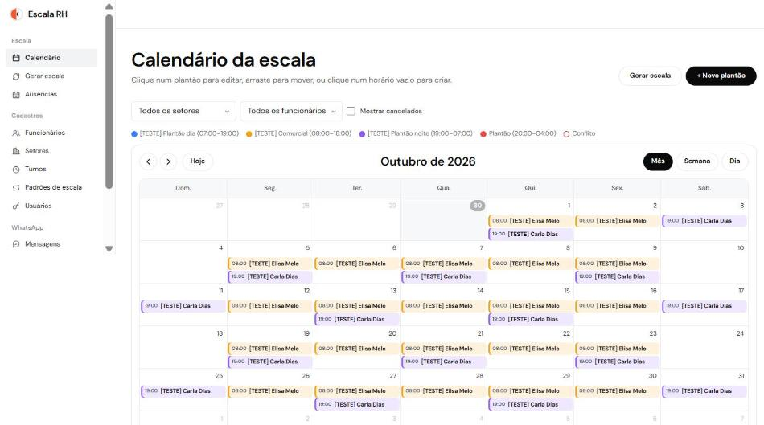

### 5.4 Conflitos: Pular × Substituir

Se você gerar de novo um período que já tem plantões, ou se houver ausências, a prévia mostra **conflitos**:

- **Sobreposição**: a pessoa já tem um plantão nesse horário.
- **Ausência**: o dia cai em férias, atestado, folga etc.

No exemplo, a escala da Ana foi gerada de novo depois de cadastrar as férias dela. Os 16 plantões vieram com conflito.
Marque **Mostrar só os plantões com conflito** para ver só os problemas.

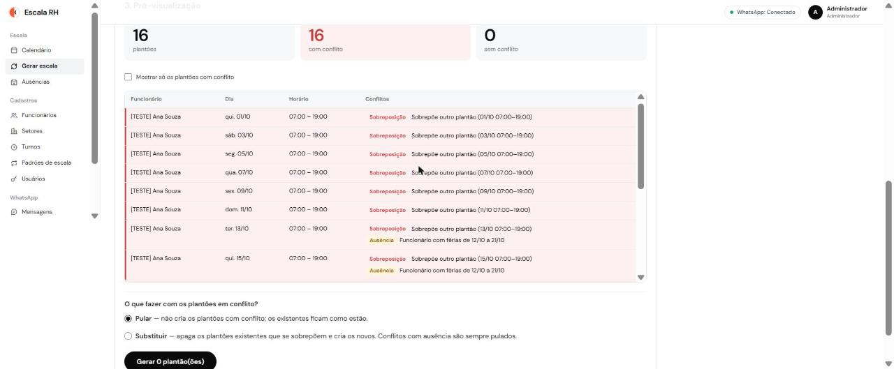

Depois escolha **O que fazer com os plantões em conflito?**:

- **Pular** *(mais seguro)*: não cria os plantões com conflito, e os existentes ficam como estão.
- **Substituir**: apaga os plantões existentes que se sobrepõem e cria os novos. **Dias de ausência são sempre pulados.**

No exemplo, com **Substituir** o botão passa a mostrar **Gerar 11 plantão(ões)**: os 5 dias de férias foram descartados.

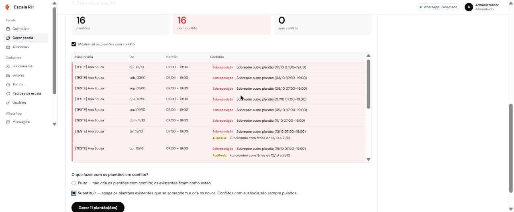

> Para não duplicar nem apagar sem querer, **confira sempre a prévia** e prefira **Pular**.

---

## 6. Calendário no dia a dia

O **Calendário** é a tela inicial (menu **Escala › Calendário**).

- Os botões **Mês / Semana / Dia** mudam a visão. As setas navegam e **Hoje** volta para a data atual.
- **Filtros** no topo: setor, funcionário e **Mostrar cancelados**.
- A legenda mostra a **cor de cada turno**. Plantão avulso aparece em **cinza**.
- **Borda vermelha com ⚠** indica conflito. Passe o mouse sobre o plantão para ver o motivo, por exemplo
  "⚠ Ausência: Funcionário com férias de 12/10 a 21/10". No topo aparece o total, por exemplo "⚠ 5 plantão(ões) com conflito".

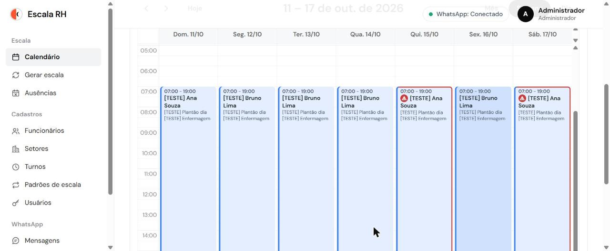

### 6.1 Editar um plantão

Clique no plantão. A janela **Editar plantão** mostra os conflitos (se houver) e permite alterar **Funcionário**,
**Setor**, **Turno**, **Início**, **Fim**, **Status** e **Observação**. Ao escolher um **turno**, o horário é preenchido sozinho.

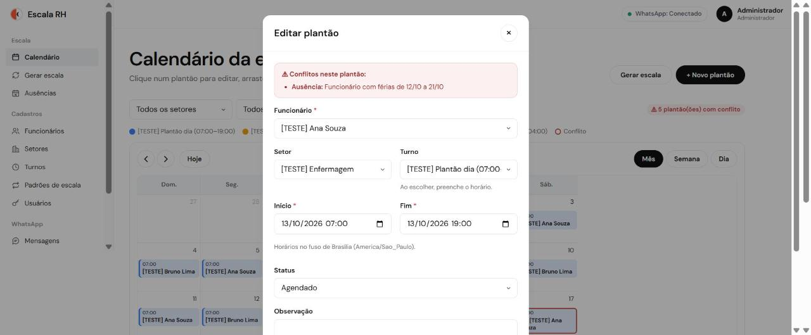

### 6.2 Troca de plantão ou cobertura

É só trocar o **Funcionário** do plantão. No exemplo, o plantão da Ana em 13/10 (dentro das férias) passou para o
Bruno, com a observação "Cobertura das férias da Ana". **O lembrete vai para a nova pessoa.**

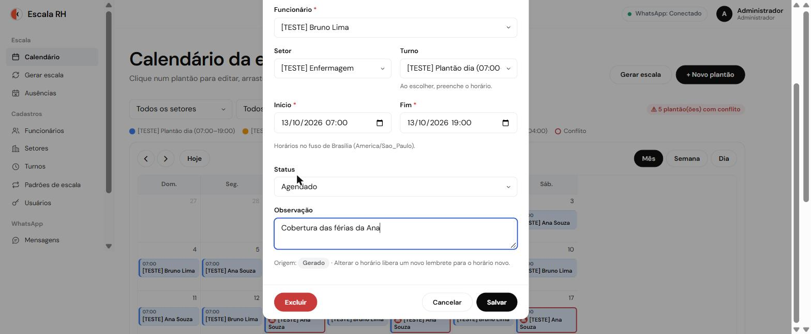

Depois de salvar, o dia 13/10 passa a ser do Bruno e o contador de conflitos cai de 5 para 4:

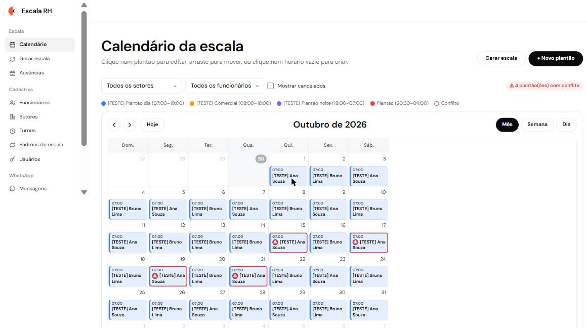

### 6.3 Plantão avulso (hora extra, cobertura pontual)

1. Clique em **+ Novo plantão** (ou num horário vazio do calendário).
2. Escolha o **Funcionário**. O **Setor** é preenchido com o setor dele.
3. Em **Turno**, deixe **Horário avulso** e informe **Início** e **Fim** à mão.
4. Clique em **Salvar**.

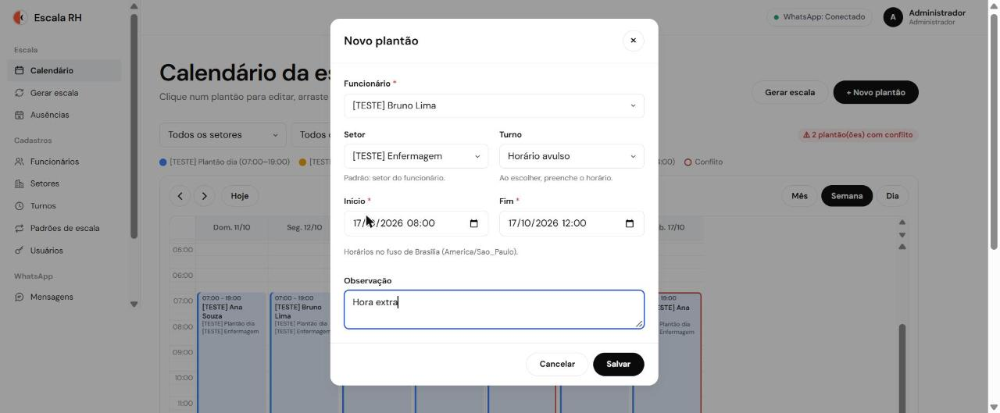

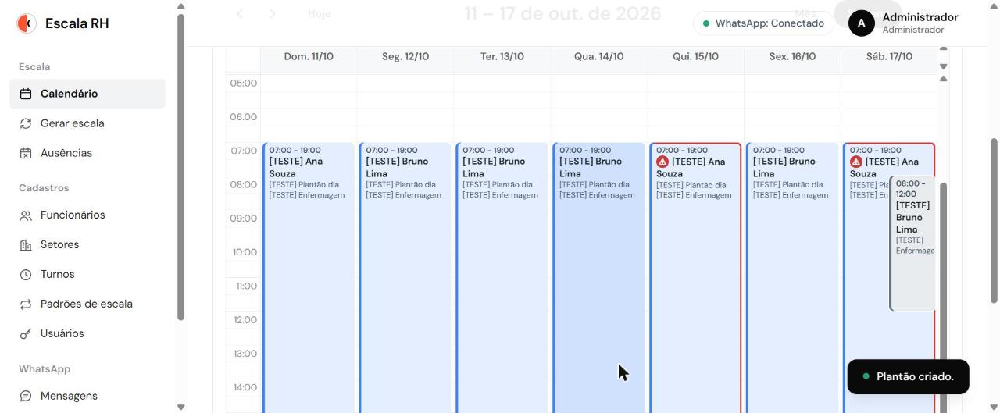

### 6.4 Arrastar e redimensionar (visões Semana e Dia)

- **Mover:** arraste o plantão para outro dia ou horário. Atenção: se cair sobre outro plantão da mesma pessoa, ele
  fica com **conflito de sobreposição** na hora.

  

  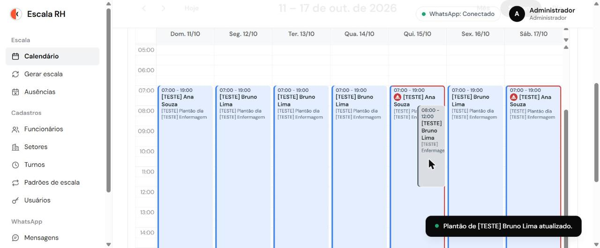

- **Mudar a duração:** puxe a **borda de baixo** do plantão. No exemplo, ele passou de 08:00–12:00 para 08:00–14:00.

  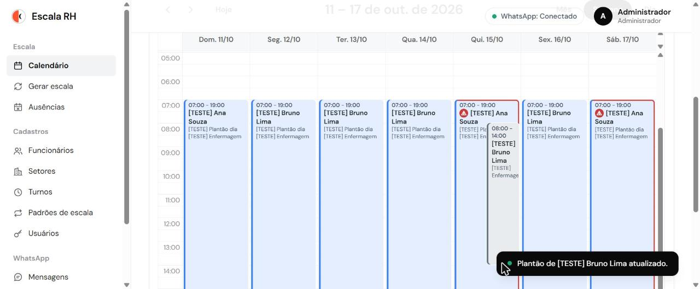

> Se você mudar o horário ou a pessoa de um plantão que **já foi lembrado**, o lembrete é enviado de novo para o novo horário.

### 6.5 Cancelar sem apagar

Abra o plantão, mude o **Status** para **Cancelado (não gera lembrete)** e clique em **Salvar**.

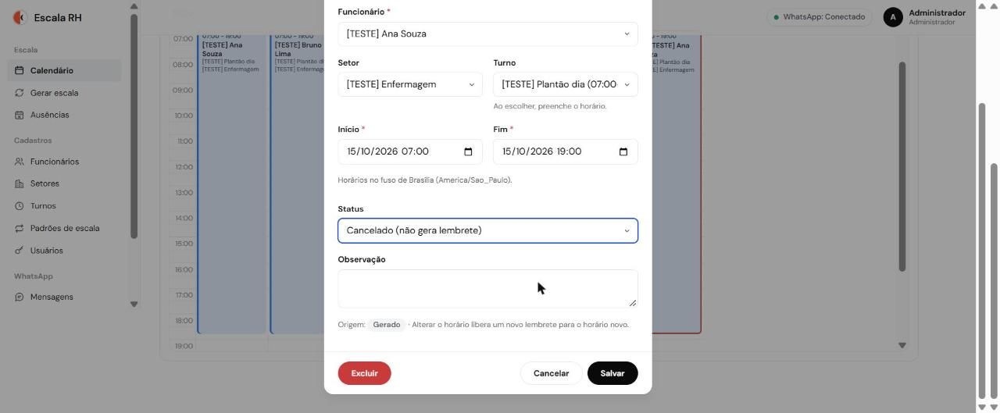

O plantão some do calendário. Para vê-lo, marque **Mostrar cancelados**: ele aparece **riscado e esmaecido**.

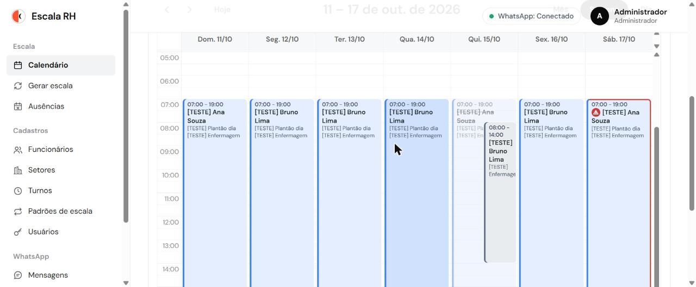

### 6.6 Excluir

Abra o plantão e clique em **Excluir** (botão vermelho). O navegador pergunta "*Excluir o plantão de … ? Esta ação não
pode ser desfeita.*" Confirme com **OK**. **É definitivo.**

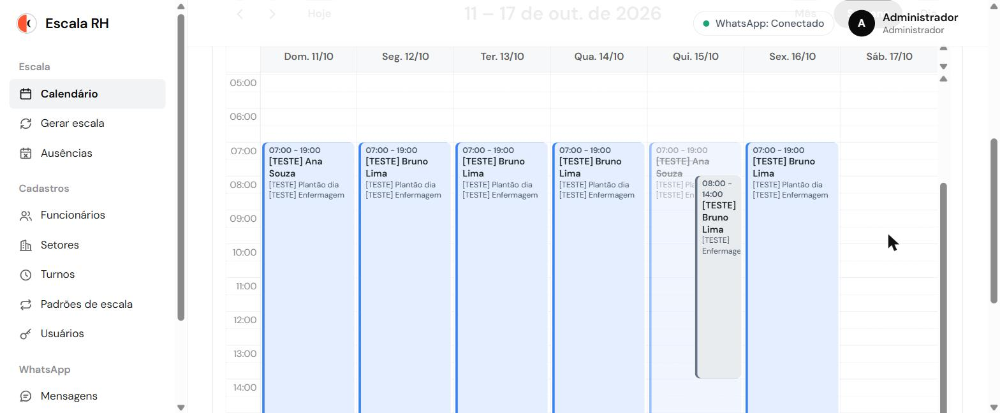

---

## 7. Ausências

1. Abra **Escala › Ausências** e clique em **+ Nova ausência**.
2. Escolha o **Funcionário** e o **Tipo**: **Férias**, **Atestado**, **Folga** ou **Outro**.
3. Preencha **Data inicial** e **Data final (inclusive)**. Se quiser, escreva uma **Observação**.
4. Clique em **Salvar**.

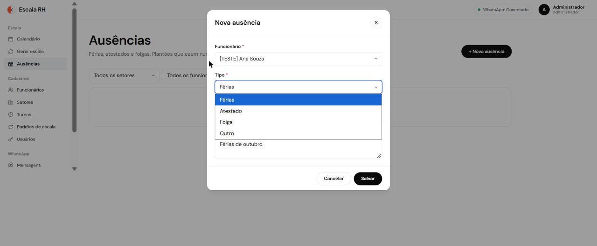

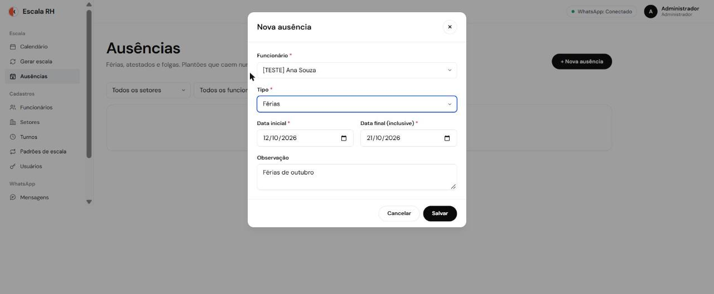

Ao salvar, o painel avisa: "*Ausência salva. Plantões no período ficarão sinalizados como conflito.*"

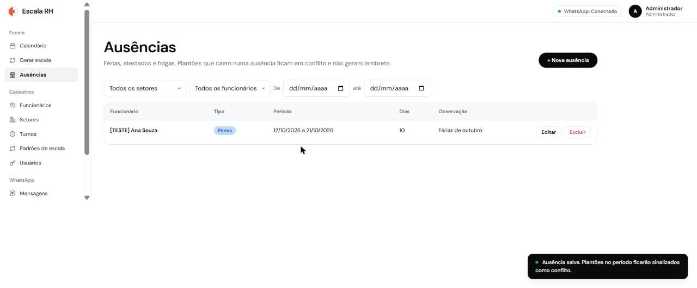

**O que acontece com os plantões nesses dias:**

- Ficam com **borda vermelha e ⚠** no calendário.
- **Não geram lembrete.**
- **Não são apagados sozinhos.** O RH decide se exclui, cancela ou passa para outra pessoa (seção 6.2).
- No gerador, os dias de ausência são **sempre pulados**.

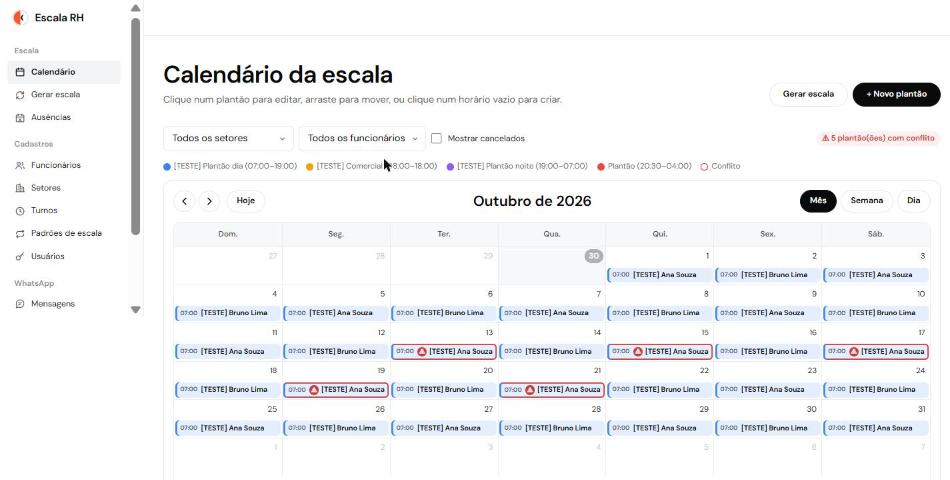

A lista de ausências pode ser filtrada por setor, funcionário e período. Cada linha tem **Editar** e **Excluir**.

---

## 8. WhatsApp: conexão, lembretes e bot

### 8.1 Conexão (só administrador)

Abra **WhatsApp › Conexão**. A tela mostra o **Status** (Conectado / Desconectado) e o número em uso. O status é
atualizado sozinho a cada 3 segundos.

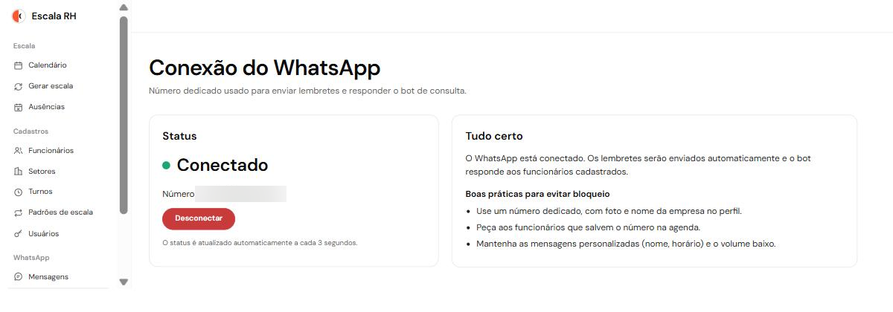

**Como conectar** (quando estiver desconectado):

1. Clique em **Conectar**. Aparece um **QR Code**.
2. No celular do **número dedicado**, abra o WhatsApp e vá em **Configurações › Aparelhos conectados › Conectar um aparelho**.
3. Aponte a câmera para o código. A tela muda sozinha para **Conectado**.
4. O QR Code expira rápido. Se expirar, gere outro.

> ⚠ **Desconectar** só deve ser usado para **trocar de número**. Enquanto estiver desconectado, nenhum lembrete sai e o
> bot não responde. Se o WhatsApp cair, aparece uma **faixa preta** no topo do painel com o botão **Conectar agora**.

**Boas práticas contra bloqueio do número:**

- Use um **número dedicado** (nunca o pessoal de alguém), com **foto e nome da empresa** no perfil.
- Peça a **todos os funcionários que salvem o número na agenda**.
- Mantenha as mensagens personalizadas (nome, horário) e **poucas regras** de lembrete.
- Nada de disparo em massa, grupos ou propaganda.
- Mantenha o celular do número ligado e com internet.

### 8.2 Regras de lembrete (só administrador)

Abra **WhatsApp › Regras de lembrete**. O sistema já vem com a regra **"1 hora antes"** (Antecedência, 60 minutos).

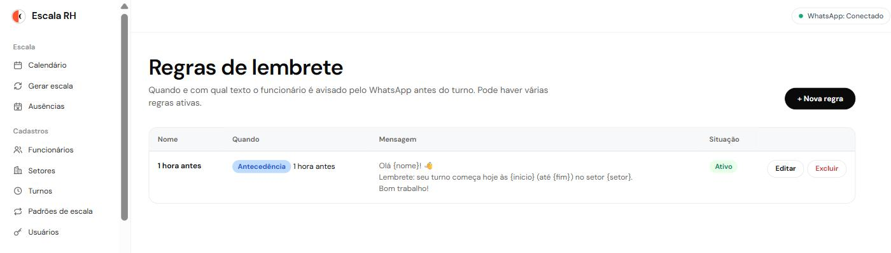

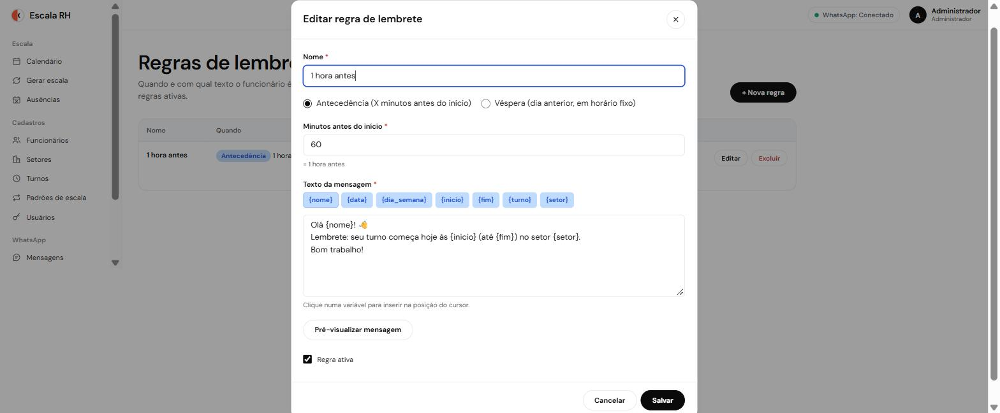

**Criar uma regra de véspera (exemplo):**

1. Clique em **+ Nova regra** e dê um **Nome**, por exemplo "Véspera 18h".
2. Escolha **Véspera (dia anterior, em horário fixo)** e informe o **Horário de envio** (18:00).
3. Escreva o **Texto da mensagem**. Clique nas variáveis para inseri-las na posição do cursor. Exemplo:
   ```
   Olá {nome}! Amanhã ({dia_semana}, {data}) você trabalha das {inicio} às {fim} — {turno}, setor {setor}.
   ```
4. Clique em **Pré-visualizar mensagem** para ver o texto com dados de exemplo.
5. Deixe **Regra ativa** marcada para valer, ou desmarcada para guardar sem usar. Depois clique em **Salvar**.

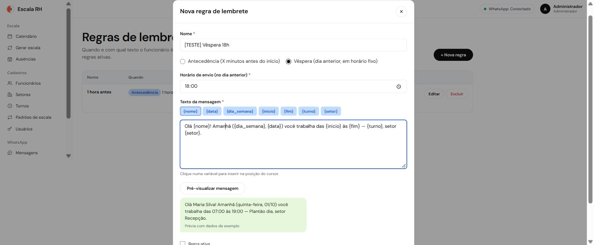

**Variáveis disponíveis:**

| Variável | Vira |
|---|---|
| `{nome}` | nome do funcionário |
| `{data}` | data do turno (dd/mm) |
| `{dia_semana}` | dia da semana por extenso (ex.: quinta-feira) |
| `{inicio}` / `{fim}` | hora de início / fim (HH:mm) |
| `{turno}` | nome do turno ("Horário avulso" se não tiver) |
| `{setor}` | setor do plantão |

**Variável escrita errada continua entre chaves na prévia.** No exemplo abaixo, `{nomee}` não foi trocado pelo nome:

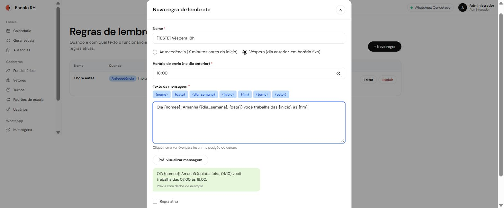

**Regras importantes:**

- Várias regras ativas geram várias mensagens por plantão (ex.: véspera + 1 h antes).
- **Sem nenhuma regra ativa, nenhum lembrete é enviado.**
- Antecedência é em minutos: 60 = 1 h, 1440 = 1 dia.
- O texto de antecedência diz "hoje"; o de véspera diz "amanhã".
- Para pausar uma regra, desmarque **Regra ativa** (é melhor que excluir).
- Plantão criado ou alterado **em cima da hora** pode perder o lembrete.
- O lembrete **nunca é enviado duas vezes**, e um lembrete que **falhou não é reenviado**.

### 8.3 O bot (o que o funcionário vê)

O funcionário manda qualquer mensagem para o número da empresa e recebe o **menu**. Depois responde só com o número da opção:

| Envia | Recebe |
|---|---|
| qualquer texto (ex.: "oi") | o menu |
| `1` | próximo turno (data, dia da semana, horário e setor) |
| `2` | escala dos próximos 7 dias |
| `3` | escala dos **próximos 30 dias** (no fim do mês já mostra o mês seguinte) |
| outra coisa | o menu de novo |

| Menu e opção 1 | Opção 2 |
|---|---|
| 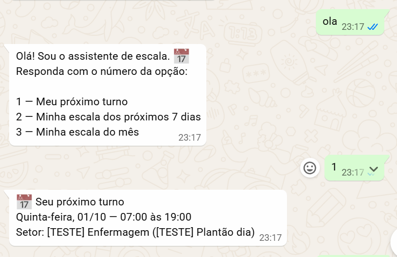 | 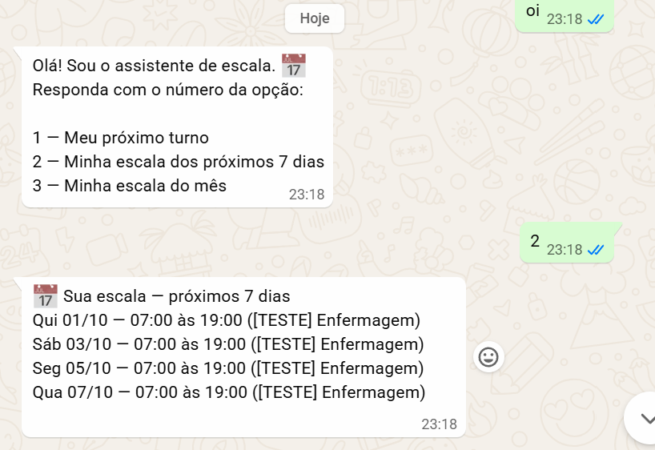 |

> A opção **3** usa uma **janela de 30 dias a partir de hoje**, e não o mês do calendário. Assim, no último dia do
> mês o funcionário já vê a escala do mês seguinte.

- O bot só responde a **funcionários ativos** cadastrados.
- Plantões dentro de uma ausência não são listados.
- O bot não responde enquanto o WhatsApp estiver desconectado.

### 8.4 Configurações do bot (só administrador)

Abra **WhatsApp › Configurações do bot**. Nessa tela você ajusta:

- **Menu do bot**: o texto enviado quando a pessoa manda algo que não é uma opção. As opções 1, 2 e 3 são **fixas**.
  Se o seu menu ainda diz "3 — Minha escala do mês", troque por "3 — Minha escala dos próximos 30 dias".
- **Mensagem quando não há turno no período**: usada nas opções 1, 2 e 3.
- **Número desconhecido** (quem não é funcionário ativo):
  - **Ignorar**: não responde nada.
  - **Responder** uma única vez com a **Mensagem padrão**.

  Só a **primeira** mensagem de cada número desconhecido é registrada e respondida.

Depois de ajustar, clique em **Salvar configurações**.

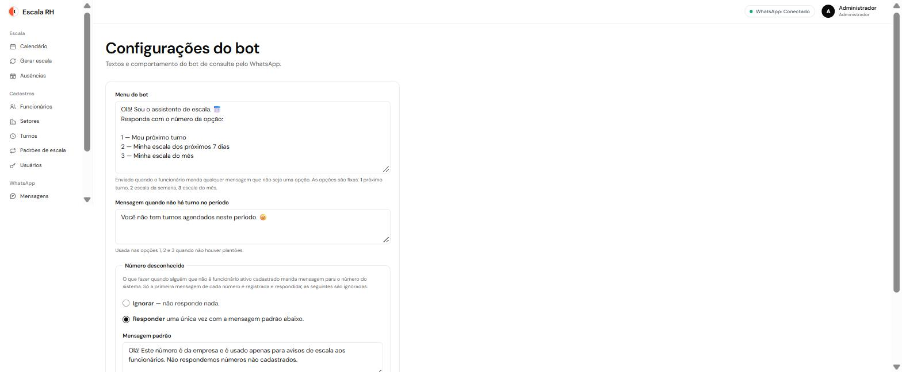

---

## 9. Histórico de mensagens e o que fazer quando falha

Abra **WhatsApp › Mensagens**. A tela mostra tudo o que foi enviado (lembretes e respostas do bot) e recebido, do mais
recente para o mais antigo.

- **Filtros:** direção (Enviadas/Recebidas), origem (Lembrete/Bot/Manual), status (OK/Falhou), funcionário e período.
  O link **Limpar filtros** volta tudo ao normal.
- Clique no texto para ver a mensagem completa.
- O gestor vê só as mensagens dos funcionários dos setores dele.

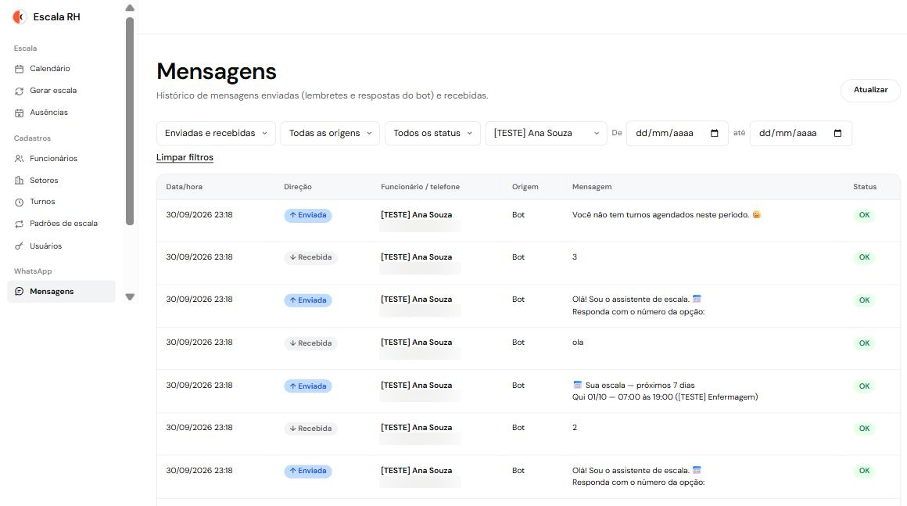

**Verifique toda semana** com o filtro **Falhou**. Se não aparecer nada, está tudo certo:

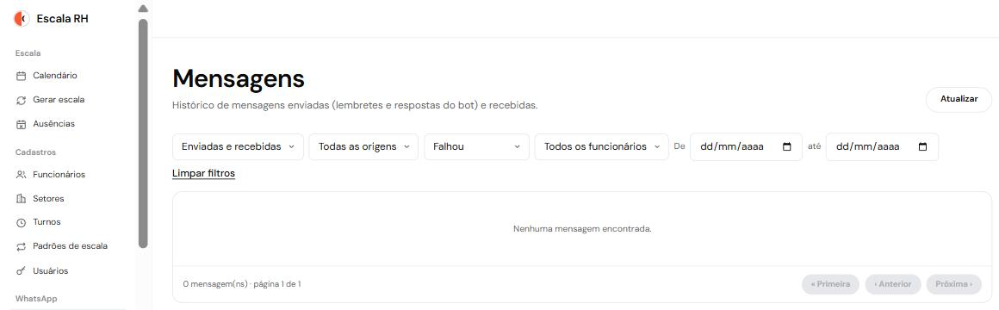

**Quando um lembrete aparece como Falhou**, o motivo aparece em vermelho abaixo do texto:

| Erro | O que fazer |
|---|---|
| "WhatsApp desconectado…" | Reconectar em **WhatsApp › Conexão** (administrador). |
| Número sem WhatsApp / inválido | Corrigir o telefone no cadastro do funcionário. |
| "Envio interrompido…" ou tempo esgotado | O sistema reiniciou no meio do envio. A mensagem pode ou não ter saído. |

> **Lembrete que falhou não é reenviado.** Depois de resolver a causa, avise o funcionário por outro meio (ligação,
> celular do setor) ou peça que ele consulte o bot (opção **1**).

---

## 10. Rotina mensal do RH

1. **Até o dia 20:** cadastre em **Ausências** as férias e afastamentos do mês seguinte.
2. Use **Gerar escala** para criar o mês seguinte, **grupo por grupo**. Como **início do ciclo**, informe um dia
   trabalhado no ciclo atual.
3. Confira o **Calendário** filtrando por setor e resolva os **⚠**.
4. **Durante o mês:** faça trocas e coberturas editando o plantão (troque o funcionário) e lance horas extras como
   **plantão avulso**.
5. **Toda semana:** abra **Mensagens** com o filtro **Falhou** e confira o status do WhatsApp no topo.

---

## 11. Perguntas frequentes

**O funcionário diz que não recebeu o lembrete.**
Procure em **Mensagens**, filtrando pelo funcionário. Se não houver nada, confira:
- se a regra está ativa;
- se o plantão está Agendado (não Cancelado);
- se não há ausência no dia;
- se o funcionário está ativo;
- se o WhatsApp está Conectado.

Se a mensagem estiver "OK", o envio saiu. Peça para o funcionário salvar o número na agenda e conferir se não bloqueou o contato.

**O bot não responde a um funcionário.**
Confira se ele está **ativo** e se o telefone cadastrado está certo (com DDD). Se ele escreve de outro número, cadastre o número correto.

**Troquei o horário de um plantão. O funcionário recebe outro lembrete?**
Sim, para o horário novo (se ainda der tempo).

**Como faço uma troca de plantão entre duas pessoas?**
No calendário, abra o plantão e troque o **Funcionário**. O lembrete vai para a nova pessoa.

**Um funcionário saiu da empresa.**
Edite o cadastro e desmarque **Ativo**. Depois exclua ou reatribua os plantões futuros dele no calendário. Use
**Excluir** só se quiser apagar a pessoa e todo o histórico de plantões dela.

**O número aparece como "já cadastrado".**
Ele pertence a outro funcionário **ativo**. Se o número mudou de dono, desative (ou exclua) o cadastro antigo e
salve de novo. Se for a mesma pessoa voltando, **reative e edite** o cadastro antigo em vez de criar outro — assim o
histórico fica junto.

**O gestor não vê um funcionário ou setor.**
Um administrador precisa marcar o setor em **Usuários › Editar › Setores que este gestor pode ver**.

**Posso apagar um setor, turno ou padrão?**
Não, apenas desativar (só funcionários podem ser excluídos). Os plantões antigos continuam com o nome e a cor.

**Gerei a escala com o ciclo errado.**
Exclua os plantões errados no calendário (ou gere de novo o período com **Substituir**, conferindo a prévia) e ajuste
a **Data de início do ciclo**.

**No 6x1 a folga não "anda" pela semana. É erro?**
Não. O ciclo 6x1 tem 7 dias, então a folga cai sempre no mesmo dia da semana — o gerador mostra qual é. Para
variar a folga entre as pessoas, gere grupos com datas de início diferentes; para trocar a folga de alguém num mês,
gere com outro início de ciclo ou ajuste os plantões no calendário.

**O painel mostra "WhatsApp desconectado".**
Só o administrador reconecta, na tela **Conexão**. Enquanto isso, nenhum lembrete é enviado e o bot não responde.
Os lembretes que deveriam ter saído nesse tempo ficam como **Falhou** e não são reenviados.

---

## Anexo: divergências e sugestões de melhoria

Pontos observados ao percorrer o sistema real em 30/09/2026 e o que foi feito com cada um:

| # | Onde | Observado | Situação |
|---|---|---|---|
| 1 | Gerar escala › prévia | O "resumo por funcionário" só aparecia com 2 ou mais pessoas selecionadas. | **Corrigido** em 01/10/2026: aparece sempre. |
| 2 | Padrão 6x1 | Por ser um ciclo de 7 dias, a folga cai sempre no mesmo dia da semana; o roteiro dizia que ela "anda". | **Documentação corrigida** e o gerador agora avisa "Folga fixa toda semana: …". Folga rotativa seria um novo tipo de padrão (não implementado). |
| 3 | Bot, opção 3 | Usava o mês corrente; no último dia do mês respondia "sem turnos". | **Corrigido**: mostra os próximos 30 dias. |
| 4 | Funcionários | Não havia exclusão, e o inativo bloqueava o telefone. | **Corrigido**: inativo libera o número e há o botão **Excluir**. |
| 5 | Gerar / Excluir plantão | As confirmações usam a caixa nativa do navegador ("Gerar N plantão(ões)?", "Excluir o plantão de…?"). | Pendente (sugestão: modal do próprio painel). |
| 6 | Topo (gestor) | O avatar mostrava a primeira letra do nome; com o prefixo "[TESTE]", aparecia "[". | **Corrigido**: usa a primeira letra ou número do nome. |
| 7 | Conexão | O número da empresa aparecia com 8 dígitos após o DDD (sem o 9). | **Corrigido**: exibido com o 9, no mesmo formato dos funcionários. |
| 8 | Telas pequenas | Num notebook com tela de 1280×720 (escala 150%), o calendário mostra poucas linhas e os modais exigem rolagem. | Pendente. |
